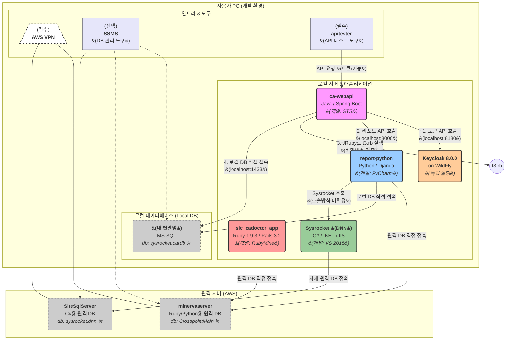

```mermaid
graph TD
    subgraph "사용자 PC (개발 환경)"
        subgraph "인프라 & 도구"
            VPN[/"(필수)<br><b>AWS VPN</b>"\]:::infra
            SSMS["(선택)<br><b>SSMS</b><br>&#40;DB 관리 도구&#41;"]:::tool
            POSTMAN["(필수)<br><b>apitester</b><br>&#40;API 테스트 도구&#41;"]:::tool
        end

        subgraph "로컬 서버 & 애플리케이션"
            A(<b>ca-webapi</b><br>Java / Spring Boot<br><i>&#40;개발: STS&#41;</i>):::java
            B(<b>Keycloak 8.0.0</b><br>on WildFly<br><i>&#40;독립 실행&#41;</i>):::keycloak
            C(<b>slc_cadoctor_app</b><br>Ruby 1.9.3 / Rails 3.2<br><i>&#40;개발: RubyMine&#41;</i>):::ruby
            D(<b>report-python</b><br>Python / Django<br><i>&#40;개발: PyCharm&#41;</i>):::python
            E(<b>Sysrocket &#40;DNN&#41;</b><br>C# / .NET / IIS<br><i>&#40;개발: VS 2015&#41;</i>):::csharp
        end

        subgraph "로컬 데이터베이스 (Local DB)"
            LOCAL_DB["<b>&#40;내 단말명&#41;</b><br>MS-SQL<br><i>db: sysrocket.cardb 등</i>"]:::database
        end
    end

    subgraph "원격 서버 (AWS)"
        REMOTE_DB_CADOCTOR["<b>minervaserver</b><br>Ruby/Python용 원격 DB<br><i>db: CrosspointMain 등</i>"]:::database
        REMOTE_DB_SYSROCKET["<b>SiteSqlServer</b><br>C#용 원격 DB<br><i>db: sysrocket.dnn 등</i>"]:::database
    end

    %% --- 연결 관계 (확정 정보만 표시) ---

    %% 사용자 요청 흐름
    POSTMAN -- "API 요청 &#40;토큰/기능&#41;" --> A

    %% ca-webapi (Java)의 역할
    A -- "1. 토큰 API 호출<br>&#40;localhost:8180&#41;" --> B
    A -- "2. 리포트 API 호출<br>&#40;localhost:8000&#41;" --> D
    A -- "3. JRuby로 t3.rb 실행<br>&#40;비밀번호 검증&#41;" --> C_RubyScript((t3.rb))
    A -- "4. 로컬 DB 직접 접속<br>&#40;localhost:1433&#41;" --> LOCAL_DB

    %% slc_cadoctor_app (Ruby)의 역할
    C -- "원격 DB 직접 접속" --> REMOTE_DB_CADOCTOR

    %% report-python의 역할
    D -- "원격 DB 직접 접속" --> REMOTE_DB_CADOCTOR
    D -- "로컬 DB 직접 접속" --> LOCAL_DB
    D -- "Sysrocket 호출<br>&#40;호출방식 미확정&#41;" --> E

    %% Sysrocket (C#)의 역할
    E -- "자체 원격 DB 접속" --> REMOTE_DB_SYSROCKET

    %% 인프라 연결
    VPN --- REMOTE_DB_CADOCTOR
    VPN --- REMOTE_DB_SYSROCKET
    SSMS -.-> LOCAL_DB
    SSMS -.-> REMOTE_DB_CADOCTOR
    SSMS -.-> REMOTE_DB_SYSROCKET

    %% 스타일 정의
    classDef java fill:#f9f,stroke:#333,stroke-width:2px;
    classDef ruby fill:#f99,stroke:#333,stroke-width:2px;
    classDef python fill:#9cf,stroke:#333,stroke-width:2px;
    classDef csharp fill:#9c9,stroke:#333,stroke-width:2px;
    classDef keycloak fill:#fc9,stroke:#333,stroke-width:2px;
    classDef database fill:#ccc,stroke:#333,stroke-width:1px,stroke-dasharray: 5 5;
    classDef infra fill:#fff,stroke:#333,stroke-width:2px,stroke-dasharray: 5 5;
    classDef tool fill:#e6e6fa,stroke:#333,stroke-width:1px;
```
